# PicoRV32 AXI4-Lite SoC — IHP SG13G2 ASIC Design

Language / Sprache: **[Deutsch](#deutsch)** | **[English](#english)**

---
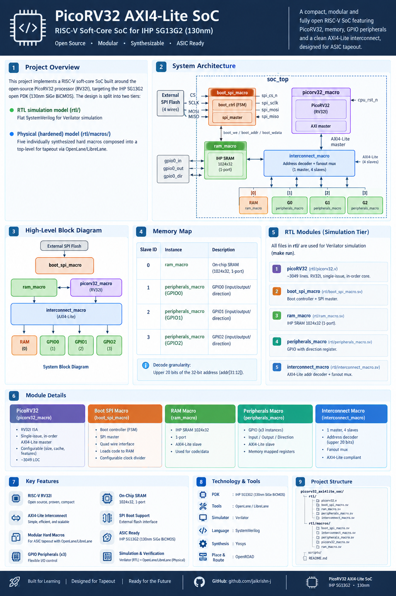

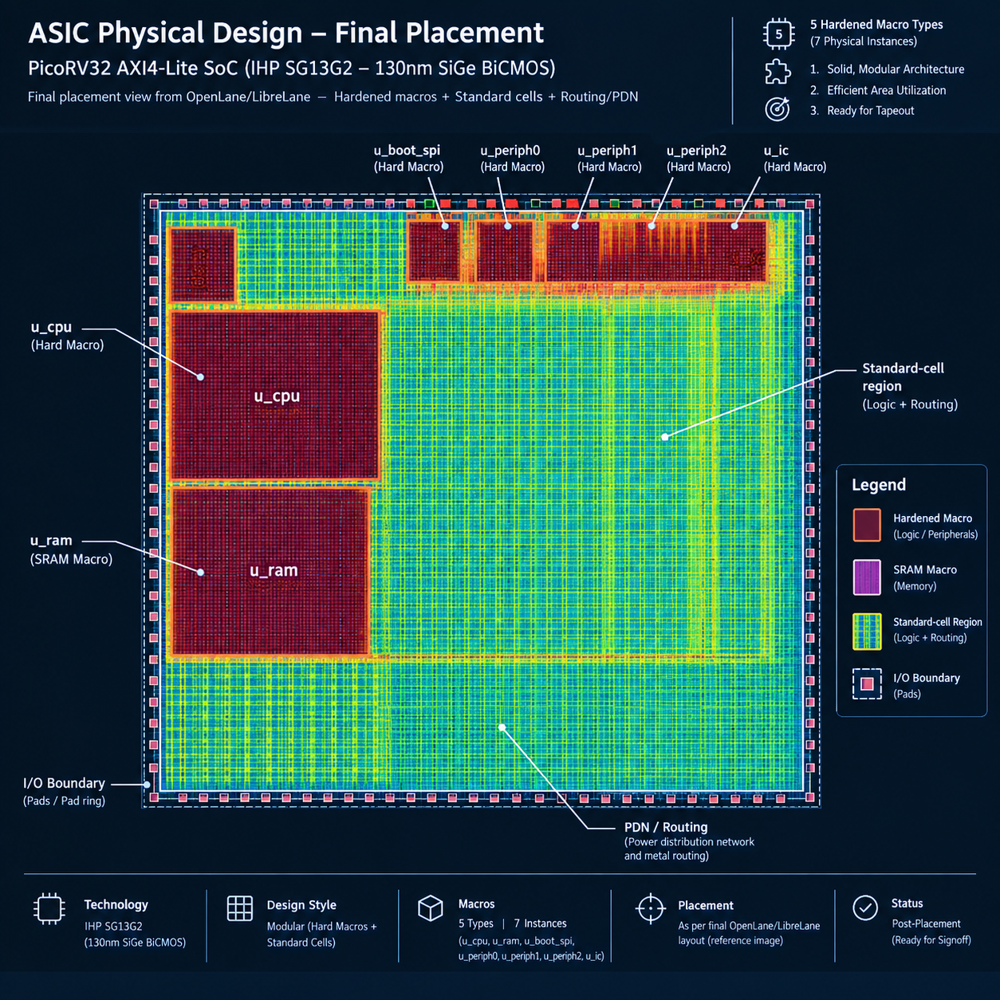

## soc_top


## boot_spi


## interconnect


## peripherals


## picorv32


## ram

<a name="deutsch"></a>
# Deutsch


<p align="center">
  <b>RISC-V RV32I · AXI4-Lite · SPI Boot · 4 KiB IHP SRAM · 3× GPIO · Hard-Macro Physical Design</b>
</p>

<p align="center">
  
  
  
  
  
  
  
</p>

> **Technischer Hinweis:** Dieses README ist ein Präsentations- und Architekturdokument, das auf dem bereitgestellten Entwurfsdokument basiert. Es unterscheidet bewusst zwischen der **RTL-Simulationsebene**, der **gehärteten Makro-Ebene** und der **physischen Integration auf Top-Ebene**. Werte, die nicht im Quelldokument enthalten sind, wurden nicht erfunden.

---

## 1. Zusammenfassung (Executive Summary)

Dieses Projekt implementiert ein kompaktes **RISC-V RV32I System-on-Chip (SoC)**, das um den Open-Source-Prozessor **PicoRV32** herum aufgebaut ist und auf die **IHP SG13G2 Open PDK** zielt, eine 130 nm SiGe BiCMOS-Technologie.

Die Architektur ist bewusst modular aufgebaut:

- **PicoRV32** dient als CPU-Ausführungseinheit.
- Ein **PicoRV32 AXI-Adapter** stellt eine AXI4-Lite-Master-Schnittstelle bereit.
- Ein dedizierter **1-zu-4 AXI4-Lite-Interconnect** übernimmt die Adressdekodierung sowie das Transaktions-Fanout/Fanin.
- Ein gehärteter **4 KiB IHP Single-Port SRAM** dient als Hauptspeicher.
- Drei identische **GPIO-Peripherie-Makros** stellen speichergerichtete E/A (Memory-mapped I/O) zur Verfügung.
- Ein **Boot-SPI-Makro** lädt die Firmware aus einem externen SPI-Flash, bevor die CPU aus dem Reset freigegeben wird.
- Die physische Implementierung unterteilt das Design in **fünf eindeutige gehärtete Makro-Typen**, wobei das Peripherie-Makro auf Top-Ebene dreimal instanziiert wird.

Das Projekt demonstriert somit den vollständigen Pfad von:

**RISC-V RTL → Simulation → Bus-/Peripherie-Verifikation → Makrosynthese → SRAM-Integration → Makro-Floorplanning → PDN → physische Integration auf Top-Ebene.**

---

## 2. Design-Überblick

| Element | Design-Wert |
|---|---|
| CPU | PicoRV32, RV32I |
| CPU-Stil | Kompakt, In-Order, Single-Issue |
| ISA-Erweiterungen/Konfiguration | Zähler + Barrel-Shifter; keine komprimierte ISA; kein MUL/DIV; kein IRQ |
| CPU-Reset-Adresse | `0x0000_0000` |
| Hauptbus | AXI4-Lite, 32-Bit |
| AXI-Topologie | 1 Master → 4 Slaves |
| SRAM | IHP `RM_IHPSG13_1P_1024x32_c2_bm_bist` |
| SRAM-Kapazität | 1024 × 32-Bit = 4 KiB |
| GPIO | 3 × 32-Bit Bänke |
| Boot | Externes SPI-Flash, Standard-READ `0x03` |
| Firmware-Image | 1024 Wörter × 4 Bytes |
| Taktziel | 10 ns Periode / 100 MHz |
| PDK | IHP SG13G2 |
| Standardzellen-Bibliothek | `sg13g2_stdcell` |
| RTL-Sprache | SystemVerilog + Verilog |
| RTL-Simulation | Verilator |
| Einheitsverifikation | Cocotb + cocotbext-axi |
| Logiksynthese | Yosys |
| Physische Implementierung | OpenLane / LibreLane + OpenROAD |
| Physische Organisation | 5 eindeutige Makro-Typen, 7 Makro-Instanzen |
| Externe E/A der Top-Ebene | SPI + 3 × GPIO + Takt/Reset |

---

## 3. Systemarchitektur

### 3.1 Blockdiagramm auf Top-Ebene


Das System ist in fünf primäre gehärtete Makro-Typen unterteilt:

1. `picorv32_macro`
2. `interconnect_macro`
3. `ram_macro`
4. `boot_spi_macro`
5. `peripherals_macro`

`peripherals_macro` wird dreimal instanziiert als `u_periph0`, `u_periph1` und `u_periph2`.

Diese Unterscheidung ist beim Lesen der physischen Hierarchie wichtig:

> **5 eindeutige gehärtete Makro-Designs → 7 physische Makro-Instanzen in `soc_top`.**

### 3.2 Mermaid-Architektur

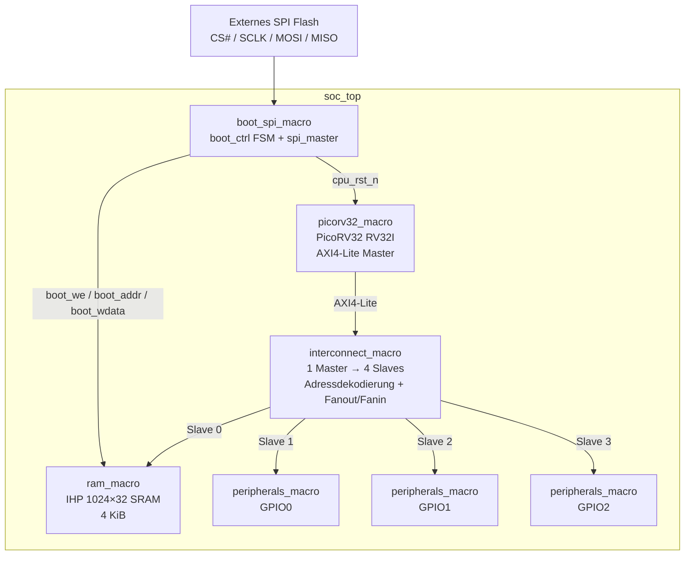

### 3.3 Transaktions-Zuordnung

Die Architektur ist bewusst einfach gehalten, da es nur einen **einzigen AXI-Master** gibt.

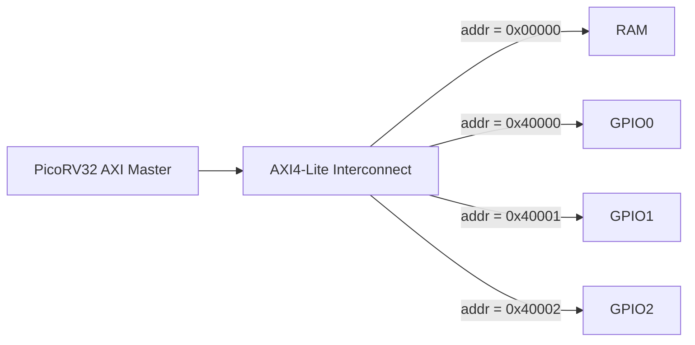

Da nur ein Master vorhanden ist, benötigt der Interconnect kein Multi-Master-Arbitrierungs-Schema. Seine Hauptaufgaben sind:

* Dekodierung des Ziel-Slaves;
* Steuerung der AXI-Valid-Signale zum ausgewählten Slave;
* Weiterleitung der Lese-/Antwortsignale zurück zum Master;
* Aufrechterhaltung der AXI-Transaktionsbeziehung.

---

# 4. Speicherbelegungsplan (Memory Map)

Der Interconnect dekodiert die **oberen 20 Adress-Bits**, `addr[31:12]`.

| Slave | Adressbereich | Instanz | Funktion |
| --- | --- | --- | --- |
| 0 | `0x0000_0000 – 0x0000_0FFF` | `ram_macro` | 4 KiB System-RAM |
| 1 | `0x4000_0000 – 0x4000_0FFF` | `peripherals_macro` / GPIO0 | GPIO-Bank 0 |
| 2 | `0x4000_1000 – 0x4000_1FFF` | `peripherals_macro` / GPIO1 | GPIO-Bank 1 |
| 3 | `0x4000_2000 – 0x4000_2FFF` | `peripherals_macro` / GPIO2 | GPIO-Bank 2 |

### Adressdekodierer

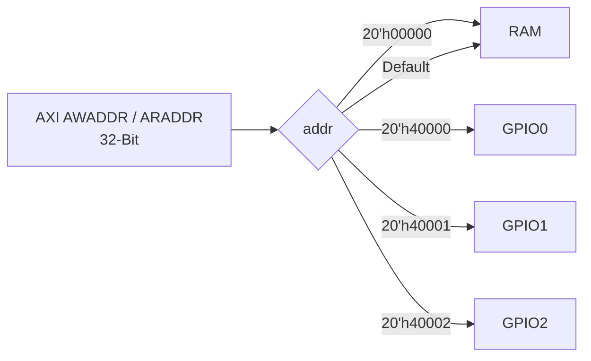

Der dokumentierte Standardpfad leitet eine nicht zugewiesene Adresse an den RAM weiter.

---

# 5. CPU-Subsystem

## 5.1 PicoRV32

Der Prozessor ist die zentrale Ausführungseinheit des SoCs.

Konfigurierte Merkmale:

| Parameter | Wert |
| --- | --- |
| `ENABLE_COUNTERS` | `1` |
| `BARREL_SHIFTER` | `1` |
| `COMPRESSED_ISA` | `0` |
| `PROGADDR_RESET` | `0x0000_0000` |
| `STACKADDR` | `0x0000_1000` |
| `ENABLE_MUL` | `0` |
| `ENABLE_DIV` | `0` |
| `ENABLE_IRQ` | `0` |

Die dokumentierte interne Struktur umfasst:

* 32 × 32-Bit Ganzzahl-Register;
* ALU;
* Komparator;
* Barrel-Shifter;
* Logikoperationen;
* Befehls-/Datenspeicherschnittstelle;
* Zustandsmaschine zur Steuerung;
* AXI4-Lite Adapter.

Das Design besitzt eine Ausführungssequenz aus acht Zuständen (einschließlich Befehlsholen, Registerzugriff, Ausführung, Shifting, Load/Store und Trap-Zuständen).

## 5.2 Native Speicherschnittstelle → AXI4-Lite

Die native Schnittstelle des PicoRV32 stellt folgende Signale bereit:

```text
mem_valid
mem_ready
mem_addr
mem_wdata
mem_wstrb
mem_rdata

```

Der AXI-Adapter übersetzt diese in AXI4-Lite-Transaktionen.

Für Schreibzugriffe:

```text
mem_valid && |mem_wstrb
        │
        ▼
mem_axi_awvalid

```

Für Lesezugriffe:

```text
mem_valid && !mem_wstrb
        │
        ▼
mem_axi_arvalid

```

Der Adapter verfolgt die AXI-Kanalaktivität mit internem Quittierungsstatus und generiert das CPU-seitige `mem_ready` aus der abgeschlossenen AXI-Antwort.

---

# 6. AXI4-Lite Interconnect

Der Interconnect ist ein **1-zu-4 AXI4-Lite Demultiplexer**.

### Schreibpfad

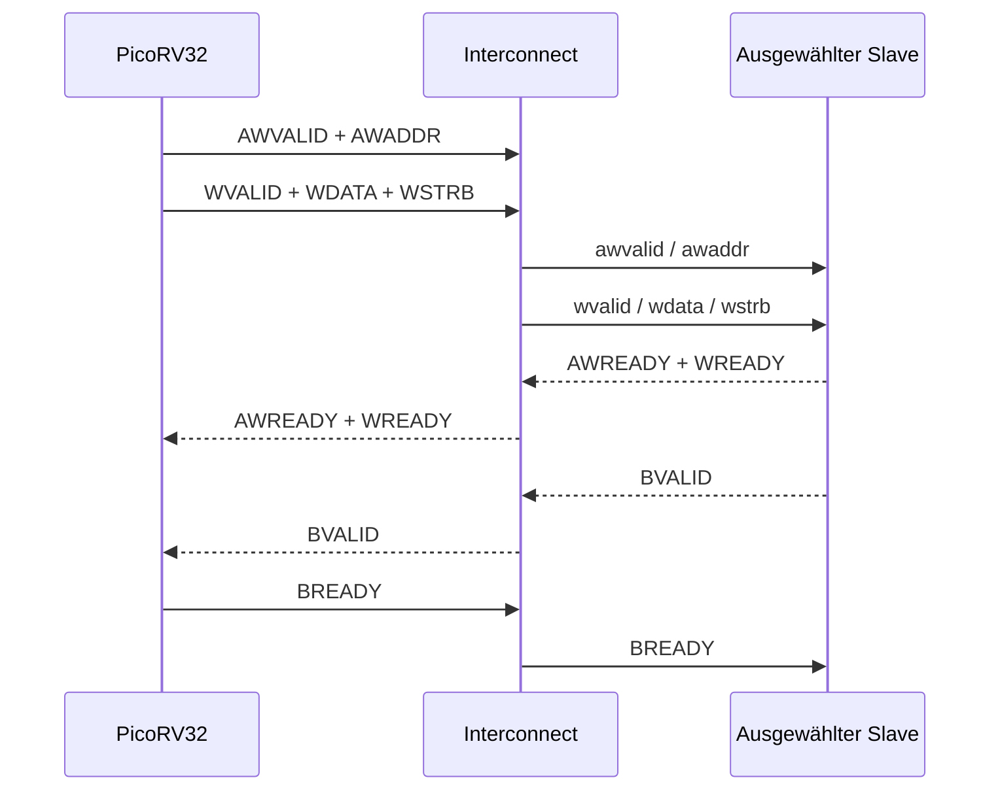

Der ausgewählte Slave wird über die Adressdekodierung ermittelt:

```text
AWVALID[selected] = M_AWVALID && AW_SEL[selected]
WVALID [selected] = M_WVALID  && AW_SEL[selected]

```

Der Antwortpfad leitet die Antwort des gewählten Slaves an die CPU zurück.

---

# 7. GPIO-Peripherie

Jedes `peripherals_macro` kapselt eine 32-Bit-GPIO-Bank.

## Registertabelle

| Offset | Register | Zugriff | Beschreibung |
| --- | --- | --- | --- |
| `0x00` | `reg_data` | R/W | GPIO-Ausgangsdaten |
| `0x04` | `reg_dir` | R/W | GPIO-Richtung (Direction) |
| `0x08` | `gpio_in` | RO | Roh-GPIO-Eingangsdaten |

### GPIO-Konzept


Schreibzugriffe nutzen die AXI-Byte-Strobes:

```text
WSTRB[3:0]

```

Die GPIO-Implementierung nutzt einen `aw_en`-Mechanismus, um die Annahme einer neuen Schreibadresse so lange zu verhindern, bis die aktuelle Schreibantwort abgeschlossen ist.

---

# 8. SRAM-Makro

Die physische Speicherimplementierung nutzt das IHP SRAM-Makro:

```text
RM_IHPSG13_1P_1024x32_c2_bm_bist

```

## SRAM-Eigenschaften

| Eigenschaft | Wert |
| --- | --- |
| Organisation | 1024 × 32 |
| Kapazität | 4096 Bytes |
| Port | Single-Port |
| Technologie | IHP SG13G2 |
| Adresse | 10-Bit Wortadresse |
| Daten | 32-Bit |
| Bit-Maske | 32-Bit |
| BIST | Vorhanden / für Normalbetrieb inaktiv geschaltet |
| `A_DLY` | Auf HIGH gelegt |

### Physische SRAM-Schnittstelle

```text
A_CLK
A_MEN
A_WEN
A_REN
A_ADDR[9:0]
A_DIN[31:0]
A_DOUT[31:0]
A_BM[31:0]
A_DLY
A_BIST_*

```

## 8.1 SRAM-Arbitrierung

Der Wrapper verarbeitet drei mögliche Aktivitätsquellen:

1. SPI-Boot-Schreiben
2. AXI-Schreiben
3. AXI-Lesen

Die Prioritätsreihenfolge lautet:

```text
Boot-Schreiben
    ↓
AXI-Schreiben
    ↓
AXI-Lesen
    ↓
Idle

```

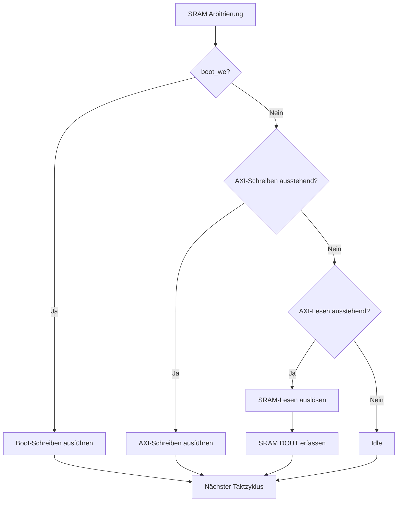

## 8.2 SRAM-Lesezustandsmaschine

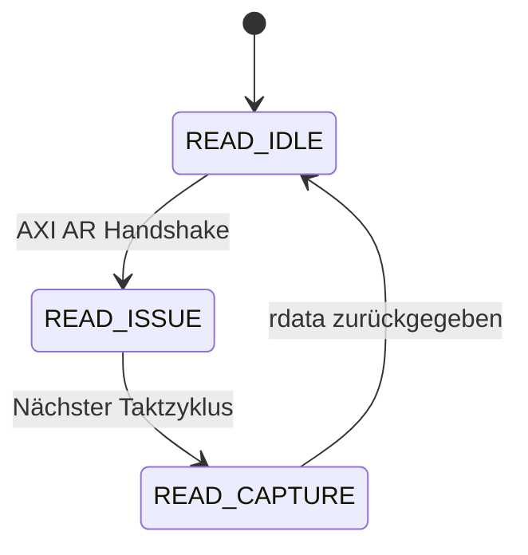

Ungültige AXI-Adressen werden abgelehnt, wenn:

```text
addr != 0

```

oder die Adresse nicht an Wortgrenzen ausgerichtet ist:

```text
addr[1:0] != 2'b00

```

Die Antwort bei fehlerhaften Zugriffen lautet:

```text
AXI_DECERR = 2'b11

```

---

# 9. SPI-Boot-Architektur

Das Boot-Subsystem kombiniert:

* `boot_ctrl`
* `spi_master`

innerhalb von `boot_spi_macro`.

## Boot-Konfiguration

| Parameter | Wert |
| --- | --- |
| Firmware-Wörter | 1024 |
| Firmware-Größe | 4 KiB |
| SPI-Befehl | `0x03` |
| SPI-Taktteiler | `CLK_DIV = 8` |
| SCLK | `clk / 16` |
| CPU-Reset | Während des Ladevorgangs aktiv gehalten |

### Boot-FSM

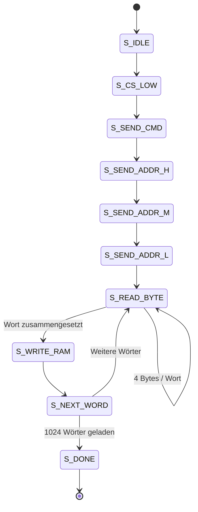

Die CPU verbleibt bis `S_DONE` im Reset-Zustand.

Der vorgesehene Ablauf ist:

```text
SPI Flash
   │
   ▼
SPI Master
   │
   ▼
boot_ctrl
   │
   ├── boot_addr
   ├── boot_wdata
   └── boot_we
          │
          ▼
      IHP SRAM
          │
          ▼
      PicoRV32

```

---

# 10. SPI-Master

Der SPI-Master ist als kompakter synchroner Controller implementiert.

Ablauf:

1. `tx_byte` speichern;
2. `busy` aktivieren;
3. Systemtakt teilen;
4. SCLK umschalten;
5. MISO bei steigender Flanke abtasten;
6. MOSI bei fallender Flanke verschieben;
7. Acht Bits zählen;
8. `done`-Impuls ausgeben.

Die Implementierung überträgt das **höchstwertige Bit zuerst (MSB first)**:

```text
mosi = tx_shift[7]

```

---

# 11. Firmware-Architektur

Die Firmware besteht aus:

```text
boot.s
link.ld
firmware.c

```

## Startvorgang

Der Reset-Einstiegspunkt lautet:

```text
_start

```

mit gelinktem Code unter:

```text
0x00000000

```

Dies entspricht der CPU-Reset-Programmadresse.

## Firmware-Erstellung

```bash
riscv64-unknown-elf-gcc \
  -march=rv32i \
  -mabi=ilp32 \
  -nostdlib \
  -T link.ld \
  boot.s firmware.c \
  -o firmware.elf

riscv64-unknown-elf-objcopy \
  -O verilog \
  --verilog-data-width=4 \
  firmware.elf \
  firmware.hex

```

Die resultierende Datei `firmware.hex` wird im Simulations-/Synthese-Ablauf verwendet.

## GPIO-Demonstration

Die Beispiel-Firmware führt eine GPIO-Loopback-Demonstration durch:

| GPIO-Bank | Ausgangs-Pin | Loopback-Eingang |
| --- | --- | --- |
| GPIO0 | 15 | 1 |
| GPIO1 | 20 | 10 |
| GPIO2 | 31 | 0 |

Ablauf der Software:

1. Konfiguration der GPIO-Richtung;
2. Ansteuerung der Ausgangs-Pins;
3. Einlesen der GPIO-Eingänge;
4. Verifikation des Loopbacks;
5. Wiederholung nach einer Software-Verzögerung.

---

# 12. Verifikationsarchitektur

Das Projekt enthält zwei Verifikationsebenen.

## 12.1 Verilator-Test auf SoC-Ebene

Die C++ Testbank führt folgende Schritte aus:

```text
Reset
  ↓
Reset freigeben
  ↓
CPU führt Firmware aus
  ↓
GPIO-Ausgänge ändern sich
  ↓
Testbank emuliert physische Leitungen
  ↓
GPIO-Eingänge werden zurückgelesen
  ↓
Pass/Fail-Zähler

```

Die Testbank läuft in einer endlosen Simulationsschleife und gibt alle 2 Millionen Zyklen einen Statusbericht (Heartbeat) aus.

### Testbank-Loopback

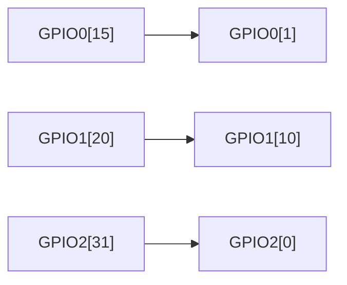

## 12.2 Cocotb GPIO-Einheitstest

Der GPIO-Einheitstest nutzt:

* Cocotb
* `cocotbext-axi`

Die Testsequenz umfasst:

```text
TEST 1 → Richtungsregister schreiben
TEST 2 → Ausgangsregister schreiben
TEST 3 → GPIO-Eingang ansteuern und über AXI einlesen

```

Dies bietet eine saubere Trennung zwischen:

* **AXI-Peripherieverifikation auf Bausteinebene**, und
* **firmwaregesteuerter Verifikation des Gesamtsystems**.

---

# 13. RTL vs. Physisch Gehärtete Architektur

Das Repository verwaltet zwei Darstellungen des Designs.

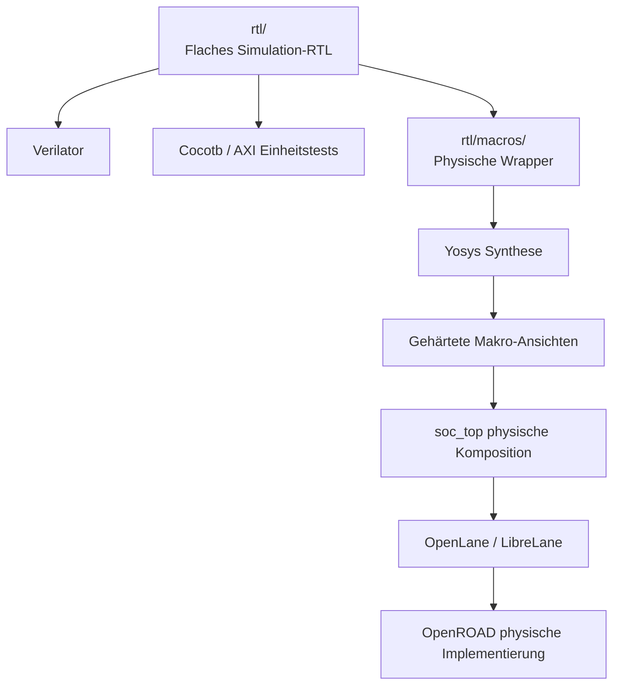

### Simulationsebene

Die Simulationshierarchie umfasst:

```text
soc_top
├── boot_ctrl
├── spi_master
├── picorv32_axi
├── axil_interconnect
├── axil_ram_sim
├── gpio_bank
├── gpio_bank
└── gpio_bank

```

### Gehärtete Ebene

Die physische Hierarchie umfasst:

```text
soc_top
├── u_cpu       → picorv32_macro
├── u_ic        → interconnect_macro
├── u_ram       → ram_macro
├── u_boot_spi  → boot_spi_macro
├── u_periph0   → peripherals_macro
├── u_periph1   → peripherals_macro
└── u_periph2   → peripherals_macro

```

Dies verdeutlicht ein wichtiges Konzept des physischen Entwurfs:

> **Das logische SoC bleibt architektonisch konsistent, während die physische Implementierung Makrogrenzen für Synthese, Platzierung, Routing und Hard-IP-Integration einführt.**

---

# 14. Physisches Design (Physical Design)

## 14.1 Technologie

Das Zielsystem verwendet:

```text
PDK     : IHP SG13G2
Library : sg13g2_stdcell
Prozess : 130 nm SiGe BiCMOS

```

Das Makro `picorv32_macro` wird gegen folgende Bibliothek synthetisiert:

```text
sg13g2_stdcell_typ_1p20V_25C.lib

```

mit 84 Zelltypen in der Synthesebibliothek.

## 14.2 Timing-Ziele

Die dokumentierten Timing-Vorgaben der Top-Ebene lauten:

| Bedingung | Wert |
| --- | --- |
| Taktperiode | 10 ns |
| Taktfrequenz | 100 MHz |
| Tastverhältnis (Duty Cycle) | 50% |
| Taktunsicherheit | 0,20 ns |
| Flankensteilheit (Transition) | 0,10 ns |
| Eingangsverzögerung (Input Delay) | 0,5–2,0 ns |
| Ausgangsverzögerung (Output Delay) | 0,5–2,0 ns |
| Reset | Asynchrones Setzen / Synchrones Rücksetzen |
| Reset-Pfad | False Path |

### Timing-Interpretation

Ein Takt von 10 ns bedeutet:

```text
Tclk = 10 ns

fclk = 1 / Tclk
     = 100 MHz

```

Das Timing-Ziel besteht darin, die synchronen Pfade innerhalb einer Taktperiode von 100 MHz unter Berücksichtigung von Unsicherheiten und E/A-Annahmen zu schließen.

---

# 15. Floorplan

Das Geometrie-Layout der Top-Ebene umfasst ca.:

```text
2300 µm × 2400 µm

```

mit einer L-förmigen digitalen Region aufgrund einer Einkerbung/Sperrfläche (Notch).

### Makro-Platzierung (X-Koordinaten)

| Instanz | X-Koordinate |
| --- | --- |
| `u_ram` | 35 µm |
| `u_cpu` | 35 µm |
| `u_boot_spi` | 35 µm |
| `u_periph0` | 850 µm |
| `u_periph1` | 1100 µm |
| `u_periph2` | 1350 µm |
| `u_ic` | 1900 µm |

Die Flächenausnutzung der Makros beträgt:

```text
50,6% der L-förmigen digitalen Fläche
2,37 mm²

```

---

# 16. Pin-Planung

Die Pin-Belegung ist wie folgt aufgeteilt:

| Seite | Signale |
| --- | --- |
| Nord | `clk_i`, `rst_ni`, `spi_cs_n`, `spi_sclk`, `spi_mosi`, `spi_miso` |
| West | `gpio0_in[*]`, `gpio0_out[*]`, `gpio0_dir[*]` |
| Süd | `gpio1_in[*]`, `gpio1_out[*]`, `gpio1_dir[*]` |
| Ost | `gpio2_in[*]`, `gpio2_out[*]`, `gpio2_dir[*]` |

Diese Platzierungsstrategie ordnet die drei GPIO-Bänke physisch den separaten Chipkanten zu, während Takt-, Reset- und SPI-Leitungen an der Nordseite gebündelt werden.

---

# 17. Stromversorgungsnetz (Power Distribution Network - PDN)

Die PDN-Konfiguration verwendet:

```text
Spannungsdomäne : CORE
Versorgung      : VDD / VSS
SRAM            : VPWR / VGND
Metallschichten : TopMetal1 + TopMetal2

```

### Ring

```text
Breite = 4,0 µm
Abstand = 4,0 µm
Offset = 4,5 µm

```

### Streifen (Stripes)

```text
Breite = 6,0 µm
Pitch  = 60,0 µm

```

Ein Via-Stack verbindet die beiden oberen Metallschichten.

Der SRAM verwendet IHP-spezifische Bezeichnungen für die Stromversorgung:

```text
VPWR
VGND

```

während die Standardzell-Domäne folgende Bezeichnungen nutzt:

```text
VDD
VSS

```

Der physische Ablauf erfordert daher eine korrekte globale Verbindung zwischen den unterschiedlichen Namenskonventionen.

---

# 18. Synthese-Ablauf auf Makro-Ebene

Der Syntheseablauf durchläuft die fünf Makro-Wrapper:

```text
picorv32_macro
interconnect_macro
peripherals_macro
boot_spi_macro
ram_macro

```

Konzeptioneller Ablauf:


Das physische RAM-Makro selbst ist ein vorgefertigtes Hard-IP des Anbieters/PDKs und wird nicht synthetisiert.

---

# 19. Philosophie der physischen Integration

Die Makro-Partitionierung bietet mehrere technische Vorteile:

### CPU-Isolierung

`picorv32_macro` enthält den Prozessor und seinen AXI-Adapter.

### Bus-Isolierung

`interconnect_macro` verwaltet die AXI-Topologie und Adressdekodierung.

### Speicher-Isolierung

`ram_macro` kapselt:

* AXI-Protokollverarbeitung;
* SRAM-Port-Arbitrierung;
* Adressvalidierung;
* Physische SRAM-Integration.

### Boot-Isolierung

`boot_spi_macro` enthält den Lade-Mechanismus für die Firmware.

### Peripherie-Wiederverwendung

`peripherals_macro` ist wiederverwendbar für GPIO0, GPIO1 und GPIO2.

Diese Trennung ergibt eine saubere physische Hierarchie, da jedes Makro über klare Aufgaben und definierte Schnittstellen verfügt.

---

# 20. Vollständiger Datenfluss

## 20.1 Einschalten / Boot-Vorgang

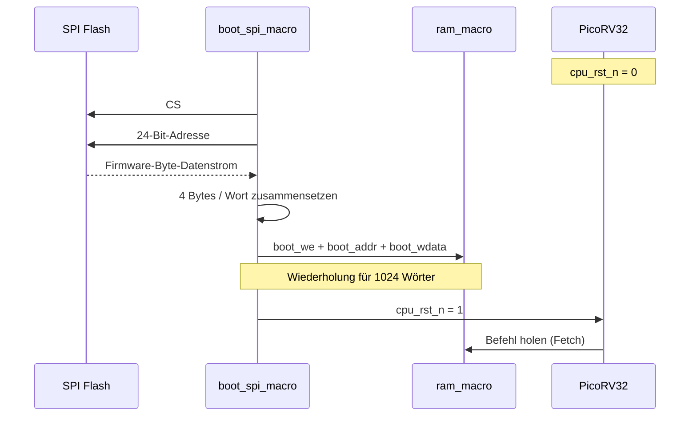

## 20.2 Normaler Ausführungsbetrieb

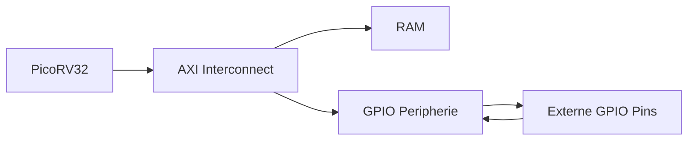

---

# 21. Beispiel für einen AXI-Schreibzugriff

Ein Schreibzugriff auf den RAM oder die GPIO verläuft wie folgt:

```text
CPU
 │
 ├── AWVALID
 ├── AWADDR
 │
 ├── WVALID
 ├── WDATA
 └── WSTRB
      │
      ▼
Interconnect
      │
      ├── Adressdekodierung
      └── Ausgewählter Slave
              │
              ├── AWREADY
              ├── WREADY
              └── BVALID
                     │
                     ▼
                   CPU

```

Für GPIO-Zugriffe:

```text
CPU
 ↓
0x4000_xxxx
 ↓
GPIO-Bank ausgewählt
 ↓
Registerdekodierung
 ↓
reg_data / reg_dir
 ↓
GPIO-Ausgang

```

---

# 22. GPIO-Beispiel auf Registerebene

Für GPIO0:

```c
#define GPIO0_BASE 0x40000000u

#define GPIO0_OUT (*(volatile uint32_t *)(GPIO0_BASE + 0x00))
#define GPIO0_DIR (*(volatile uint32_t *)(GPIO0_BASE + 0x04))
#define GPIO0_IN  (*(volatile uint32_t *)(GPIO0_BASE + 0x08))

```

Für GPIO1:

```text
GPIO1_BASE = 0x40001000

```

Für GPIO2:

```text
GPIO2_BASE = 0x40002000

```

Dies erzeugt ein einfaches, für die Software direkt sichtbares Peripheriemodell ohne komplexen Peripheriebus.

---

# 23. Struktur des Repositories

Das Repository ist wie folgt organisiert:

```text
picorv32_axi4lite_soc/
│
├── rtl/
│   ├── picorv32.v
│   ├── axil_interconnect.sv
│   ├── axi_ram.sv
│   ├── gpio_bank.sv
│   ├── boot_ctrl.sv
│   ├── spi_master.sv
│   ├── soc_top.sv
│   │
│   ├── vendor/
│   │   ├── axi/
│   │   └── common_cells/
│   │
│   └── macros/
│       ├── picorv32_macro.sv
│       ├── interconnect_macro.sv
│       ├── peripherals_macro.sv
│       ├── boot_spi_macro.sv
│       └── ram_macro.sv
│
├── firmware/
│   ├── boot.s
│   ├── firmware.c
│   ├── link.ld
│   └── firmware.hex
│
├── tb/
│   ├── sim_main.cpp
│   └── gpio_bank/
│       └── test_gpio.py
│
├── physical_design/
│   └── ...
│
└── README.md

```

---

# 24. Verwendete Werkzeuge (Toolchain)

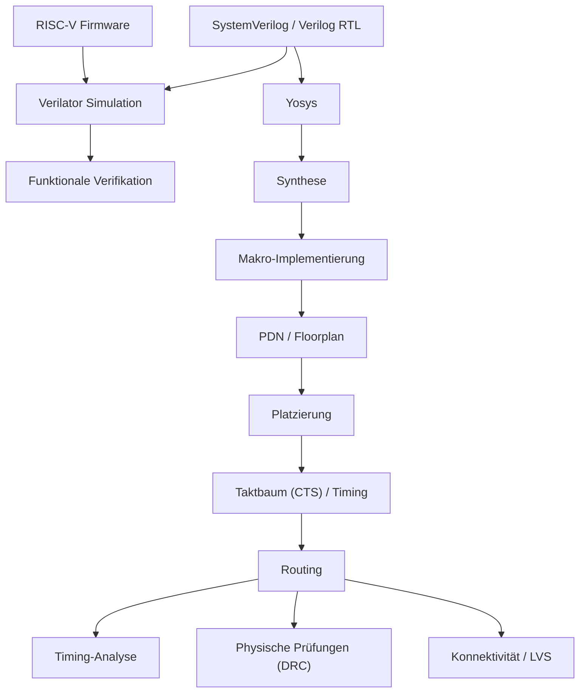

---

# 25. Verifikationsmatrix

| Ebene | Ziel | Werkzeug / Mechanismus |
| --- | --- | --- |
| CPU / SoC RTL | Systemverhalten | Verilator |
| Firmware | Zusammenspiel von CPU, Speicher & GPIO | C Firmware |
| GPIO Baustein | AXI-Registerverhalten | Cocotb + cocotbext-axi |
| Makro-Synthese | Synthetisierbarkeit / Abbildung | Yosys |
| Physisches Makro | Platzierung / Routing | OpenLane / LibreLane / OpenROAD |
| SRAM-Integration | Physische Hard-Macro-Anbindung | IHP SRAM Makro |
| Top-Ebene Physisch | Floorplan / PDN / Routing | OpenROAD-basierter Ablauf |

---

# 26. Besondere Merkmale des Designs

## Modulare Hard-Macro-Partitionierung

Demonstriert physische Partitionierung bei gleichbleibender Systemarchitektur.

## Open-Source Digital-Flow

Verwendet Open-Source-Werkzeuge (`Yosys`, `OpenLane / LibreLane`, `OpenROAD`, `Verilator`, `Cocotb`) mit einer offenen PDK.

## Echte SRAM-Hard-IP-Integration

Verwendet anstelle von synthetisierten Flip-Flops ein physisches IHP SRAM Hard-Macro.

## Bootfähige Architektur

Enthält eine SPI-Firmware-Ladelogik zur Befüllung des SRAMs vor dem CPU-Start.

## AXI4-Lite Subsystem

Kommunikation über einen standardisierten, leichten AMBA-Speicherbus.

## Wiederverwendbares GPIO-Makro

Eine einzige GPIO-Implementierung wird physisch dreimal instanziiert.

---

# 27. Wichtige Design-Hinweise

### Simulation vs. Synthese

Boot-Controller und RAM verhalten sich in der Simulation und Synthese durch ``ifndef SYNTHESIS`-Blöcke unterschiedlich. Die Simulation nutzt direkt das Firmware-Image für schnelles Testen, während die Synthese die SPI-Boot-FSM nutzt.

### SRAM-Versorgungspins

Das funktionale Modell zeigt nicht alle physischen Versorgungspins. Die physische Anbindung wird während des Physischen Designs verwaltet.

### SRAM-Arbitrierung

Der Single-Port SRAM Wrapper priorisiert Zugriffe wie folgt:

```text
Boot > AXI-Schreiben > AXI-Lesen

```

### Deaktivierte CPU-Funktionen

Die PicoRV32-Konfiguration verzichtet bewusst auf `M-Extension`, `D-Extension`, `Compressed ISA`, `IRQ` und `PCPI`, um das Design kompakt zu halten.

---

# 28. Prüfliste für die physische Freigabe (Signoff Checklist)

Vor einem physischen Signoff sollten folgende Punkte geprüft werden:

* [ ] RTL Lint fehlerfrei
* [ ] RTL Simulations-Regression erfolgreich
* [ ] Cocotb AXI-Peripherietests erfolgreich
* [ ] Firmware-Image reproduzierbar
* [ ] Synthese-Warnungen überprüft
* [ ] Makro-Schnittstellen unveränderlich
* [ ] Makro LEF/DEF Konsistenz geprüft
* [ ] Pin-Platzierung verifiziert
* [ ] Strom-/Masseverbindungen geprüft
* [ ] PDN-Konnektivität verifiziert
* [ ] Taktbaum-Implementierung (CTS) überprüft
* [ ] Setup-Timing in allen Ecken (Corners) geprüft
* [ ] Hold-Timing in allen Ecken geprüft
* [ ] Max Transition geprüft
* [ ] Max Capacitance geprüft
* [ ] Fanout-Grenzen geprüft
* [ ] DRC fehlerfrei
* [ ] LVS fehlerfrei
* [ ] Antennenprüfungen erfolgreich
* [ ] SRAM-Integrationsprüfungen abgeschlossen
* [ ] Top-Ebene Routing abgeschlossen
* [ ] Finales GDS generiert
* [ ] Konsistenz zwischen Netzliste und Layout verifiziert

---

# 29. PVT- und Timing-Bewertung

Für das Schließen der physischen Pfade (Timing Closure) müssen Setup- und Hold-Zeiten unter den vom PDK unterstützten Process-Voltage-Temperature (PVT) Corners bewertet werden:

```text
Slow / Low-V / Hot (Langsam / Niedrige Spannung / Heiß)
        │
        └── Maximale Pfadverzögerung
                         ↓
                       SETUP

Fast / High-V / Cold (Schnell / Hohe Spannung / Kalt)
        │
        └── Minimale Pfadverzögerung
                         ↓
                        HOLD

```

---

# 30. Makro-Schnittstellenvereinbarung

Jedes gehärtete Makro fungiert als Schnittstellenvereinbarung:

```text
                    +----------------------+
                    |     MACRO            |
                    |                      |
    Takt    ------->| Takt/Reset           |
    AXI     ------->| AXI-Schnittstelle    |
    GPIO    ------->| GPIO-Schnittstelle   |
    SPI     ------->| SPI-Schnittstelle    |
                    |                      |
                    +----------------------+

```

Die Top-Ebene muss die interne Logik der Makros nicht kennen. Dies vereinfacht den physischen Entwurfsprozess erheblich.

---

# 31. Designphilosophie

Der Gesam Ablauf lässt sich wie folgt zusammenfassen:

```text
         OPEN RTL
            │
            ▼
   VERHALTEN VERIFIZIEREN
            │
            ▼
    MAKROS DEFINIEREN
            │
            ▼
    LOGIK SYNTHETISIEREN
            │
            ▼
    HARD-IP INTEGRIEREN
            │
            ▼
        FLOORPLAN
            │
            ▼
          PDN
            │
            ▼
       PLATZIERUNG
            │
            ▼
      TAKT / ROUTING
            │
            ▼
     TIMING- UND PHYSISCHE
         VERIFIKATION

```

---

# 32. Schnellstart — Ablauf

```bash
# 1. Firmware erstellen
riscv64-unknown-elf-gcc \
  -march=rv32i \
  -mabi=ilp32 \
  -nostdlib \
  -T link.ld \
  boot.s firmware.c \
  -o firmware.elf

# 2. Verilog-Speicherabbild generieren
riscv64-unknown-elf-objcopy \
  -O verilog \
  --verilog-data-width=4 \
  firmware.elf firmware.hex

# 3. RTL-Simulation ausführen
make run

# 4. Physische Implementierung starten
# OpenLane / LibreLane Konfiguration des Repositories nutzen

```

---

# 33. Wert des Projekts als ASIC-Designstudie

Das Projekt verknüpft mehrere ASIC-Entwurfsebenen:

| Bereich | Demonstriertes Element |
| --- | --- |
| Computerarchitektur | RV32I CPU |
| RTL-Design | SystemVerilog Module |
| Busarchitektur | AXI4-Lite |
| Peripheriedesign | Speichergerichtetes GPIO |
| Boot-Architektur | SPI Flash Loader |
| Speichersubsystem | SRAM-Wrapper + Arbitrierung |
| Verifikation | Verilator + Cocotb |
| Synthese | Yosys |
| Hard IP | IHP SRAM |
| Floorplanning | Makro-Platzierung |
| Physischer Entwurf | OpenLane / LibreLane / OpenROAD |
| Stromversorgung | PDN / Globale Verbindungen |
| Timing | SDC Constraints |
| SoC-Integration | Multi-Makro Top-Ebene |

---

# 34. Empfohlene Präsentationsreihenfolge

Für ein technisches Portfolio empfiehlt sich folgende visuelle Sequenz:

```text
01 Architektur → 02 Speicherplan → 03 Boot-Ablauf → 04 RTL-Simulation → 05 Makro-Partitionierung → 06 Floorplan → 07 PDN → 08 Platzierung → 09 Routing → 10 Timing / DRC / LVS

```

---

# 35. Referenzen im Repository

Wichtige Quelldateien im Projekt:

```text
rtl/picorv32.v
rtl/axil_interconnect.sv
rtl/axi_ram.sv
rtl/gpio_bank.sv
rtl/boot_ctrl.sv
rtl/spi_master.sv
rtl/soc_top.sv

rtl/macros/picorv32_macro.sv
rtl/macros/interconnect_macro.sv
rtl/macros/peripherals_macro.sv
rtl/macros/boot_spi_macro.sv
rtl/macros/ram_macro.sv

```

Firmware & Testbank:

```text
firmware/ (boot.s, firmware.c, link.ld, firmware.hex)
tb/ (sim_main.cpp, gpio_bank/test_gpio.py)
physical_design/

```

---

# 36. Architektur-Übersicht (Mindmap)

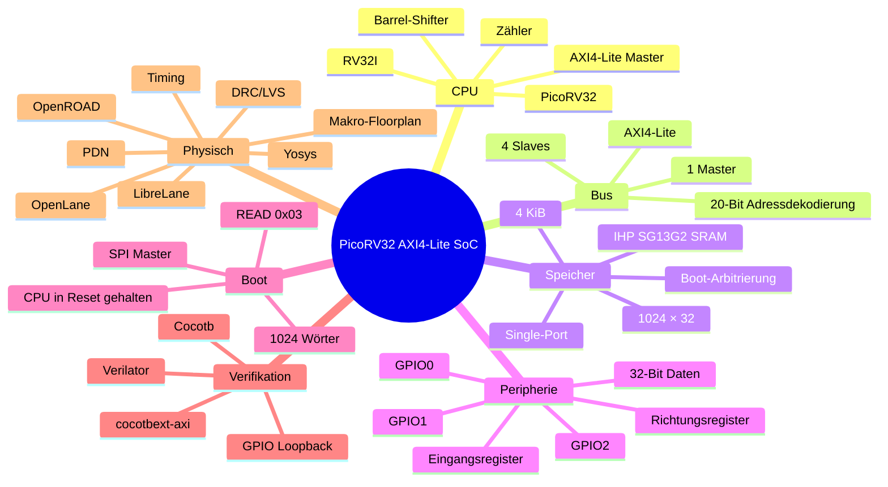

---

## Lizenz / Quellenangabe

Der PicoRV32-Prozessorkern stammt von **Claire Xenia Wolf** und steht unter der **ISC-Lizenz**.

Weitere Lizenzbestimmungen sind den jeweiligen Dateien im Repository zu entnehmen.

---

---

# English

> **Engineering note:** This README is a presentation and architecture document based on the supplied project design document. It intentionally distinguishes the **RTL simulation tier**, **hardened macro tier**, and **top-level physical integration**. Values not provided by the source document are not invented.

---

## 1. Executive Summary

This project implements a compact **RISC-V RV32I system-on-chip** built around the open-source **PicoRV32** processor and targeted to the **IHP SG13G2 open PDK**, a 130 nm SiGe BiCMOS technology.

The architecture is deliberately modular:

* **PicoRV32** provides the CPU execution engine.
* A **PicoRV32 AXI adapter** exposes an AXI4-Lite master interface.
* A dedicated **1-to-4 AXI4-Lite interconnect** performs address decoding and transaction fanout/fanin.
* A hardened **4 KiB IHP single-port SRAM** provides the main memory.
* Three identical **GPIO peripheral macros** expose memory-mapped I/O.
* A **boot SPI macro** loads firmware from external SPI flash before releasing the CPU from reset.
* The physical implementation separates the design into **five unique hardened macro types**, with the peripheral macro instantiated three times at the top level.

The project therefore demonstrates the complete path from:

**RISC-V RTL → simulation → bus/peripheral verification → macro synthesis → SRAM integration → macro floorplanning → PDN → top-level physical composition.**

---

## 2. Design-at-a-Glance

| Item | Design value |
| --- | --- |
| CPU | PicoRV32, RV32I |
| CPU style | Compact, in-order, single-issue |
| ISA extensions/configuration | Counters + barrel shifter; no compressed ISA; no MUL/DIV; no IRQ |
| CPU reset address | `0x0000_0000` |
| Main bus | AXI4-Lite, 32-bit |
| AXI topology | 1 master → 4 slaves |
| SRAM | IHP `RM_IHPSG13_1P_1024x32_c2_bm_bist` |
| SRAM capacity | 1024 × 32-bit = 4 KiB |
| GPIO | 3 × 32-bit banks |
| Boot | External SPI flash, standard READ `0x03` |
| Firmware image | 1024 words × 4 bytes |
| Clock target | 10 ns period / 100 MHz |
| PDK | IHP SG13G2 |
| Standard-cell library | `sg13g2_stdcell` |
| RTL language | SystemVerilog + Verilog |
| RTL simulation | Verilator |
| Unit verification | Cocotb + cocotbext-axi |
| Logic synthesis | Yosys |
| Physical implementation | OpenLane / LibreLane + OpenROAD |
| Physical organization | 5 unique macro types, 7 macro instances |
| Top-level external I/O | SPI + 3 × GPIO + clock/reset |

---

## 3. System Architecture

### 3.1 Top-Level Block Diagram

The system is divided into five primary hardened macro types:

1. `picorv32_macro`
2. `interconnect_macro`
3. `ram_macro`
4. `boot_spi_macro`
5. `peripherals_macro`

`peripherals_macro` is instantiated three times as `u_periph0`, `u_periph1`, and `u_periph2`.

This distinction is important when reading the physical hierarchy:

> **5 unique hardened macro designs → 7 physical macro instances at `soc_top`.**

### 3.2 Mermaid Architecture

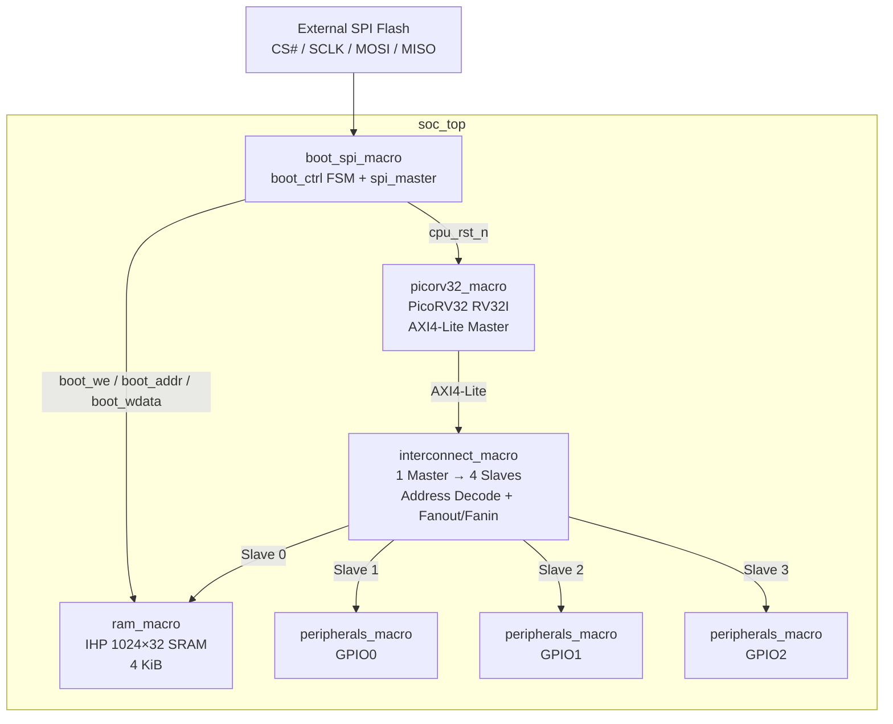

### 3.3 Transaction Ownership

The architecture is intentionally simple because there is a **single AXI master**.


Because there is only one master, the interconnect does not require a multi-master arbitration scheme. Its principal responsibilities are:

* decode the target slave;
* gate AXI valid signals toward the selected slave;
* route read/write responses back to the master;
* preserve the AXI transaction relationship.

---

# 4. Memory Map

The interconnect decodes the **upper 20 address bits**, `addr[31:12]`.

| Slave | Address range | Instance | Function |
| --- | --- | --- | --- |
| 0 | `0x0000_0000 – 0x0000_0FFF` | `ram_macro` | 4 KiB system RAM |
| 1 | `0x4000_0000 – 0x4000_0FFF` | `peripherals_macro` / GPIO0 | GPIO bank 0 |
| 2 | `0x4000_1000 – 0x4000_1FFF` | `peripherals_macro` / GPIO1 | GPIO bank 1 |
| 3 | `0x4000_2000 – 0x4000_2FFF` | `peripherals_macro` / GPIO2 | GPIO bank 2 |

### Address decoder


The documented default path maps an unmatched address to RAM.

---

# 5. CPU Subsystem

## 5.1 PicoRV32

The processor is the central execution engine of the SoC.

Configured features:

| Parameter | Value |
| --- | --- |
| `ENABLE_COUNTERS` | `1` |
| `BARREL_SHIFTER` | `1` |
| `COMPRESSED_ISA` | `0` |
| `PROGADDR_RESET` | `0x0000_0000` |
| `STACKADDR` | `0x0000_1000` |
| `ENABLE_MUL` | `0` |
| `ENABLE_DIV` | `0` |
| `ENABLE_IRQ` | `0` |

The documented internal structure contains:

* 32 × 32-bit integer registers;
* ALU;
* comparator;
* barrel shifter;
* logical operations;
* instruction/data memory interface;
* control state machine;
* AXI4-Lite adapter.

The source design documents an eight-state execution sequence including fetch, register access, execution, shifting, load/store and trap states.

## 5.2 Native Memory Interface → AXI4-Lite

PicoRV32's native interface exposes:

```text
mem_valid
mem_ready
mem_addr
mem_wdata
mem_wstrb
mem_rdata

```

The AXI adapter translates this into AXI4-Lite transactions.

For a write:

```text
mem_valid && |mem_wstrb
        │
        ▼
mem_axi_awvalid

```

For a read:

```text
mem_valid && !mem_wstrb
        │
        ▼
mem_axi_arvalid

```

The adapter tracks AXI channel activity with internal acknowledgement state and generates the CPU-side `mem_ready` from the completed AXI response.

---

# 6. AXI4-Lite Interconnect

The interconnect is a **1-to-4 AXI4-Lite demultiplexer**.

### Write path


The selected slave is determined from the address decode.

For the documented design:

```text
AWVALID[selected] = M_AWVALID && AW_SEL[selected]
WVALID [selected] = M_WVALID  && AW_SEL[selected]

```

The response path returns the selected slave's response to the CPU.

---

# 7. GPIO Peripheral

Each `peripherals_macro` wraps a 32-bit GPIO bank.

## Register map

| Offset | Register | Access | Description |
| --- | --- | --- | --- |
| `0x00` | `reg_data` | R/W | GPIO output data |
| `0x04` | `reg_dir` | R/W | GPIO direction |
| `0x08` | `gpio_in` | RO | Raw GPIO input |

### GPIO concept

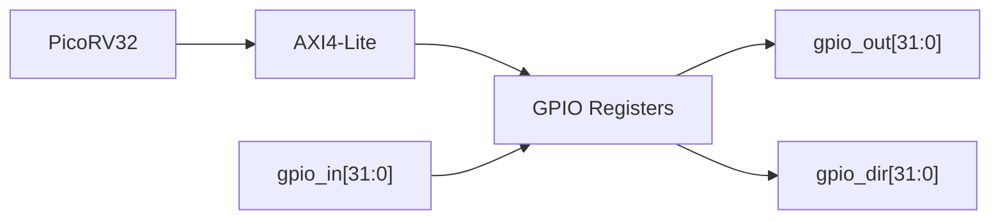

Writes use the AXI byte strobes:

```text
WSTRB[3:0]

```

The GPIO implementation uses an `aw_en` mechanism to prevent accepting a new write address until the current write response has completed.

---

# 8. SRAM Macro

The physical memory implementation uses the IHP SRAM macro:

```text
RM_IHPSG13_1P_1024x32_c2_bm_bist

```

## SRAM characteristics

| Property | Value |
| --- | --- |
| Organization | 1024 × 32 |
| Capacity | 4096 bytes |
| Port | Single-port |
| Technology | IHP SG13G2 |
| Address | 10-bit word address |
| Data | 32-bit |
| Bit mask | 32-bit |
| BIST | Present / tied off for normal operation |
| `A_DLY` | Tied HIGH |

### Physical SRAM interface

```text
A_CLK
A_MEN
A_WEN
A_REN
A_ADDR[9:0]
A_DIN[31:0]
A_DOUT[31:0]
A_BM[31:0]
A_DLY
A_BIST_*

```

## 8.1 SRAM Arbitration

The wrapper has three possible sources of activity:

1. SPI boot write
2. AXI write
3. AXI read

The documented priority is:

```text
boot write
    ↓
AXI write
    ↓
AXI read
    ↓
idle

```

```mermaid
flowchart TD
    START["SRAM arbitration"] --> B{"boot_we?"}
    B -->|Yes| BW["Service boot write"]
    B -->|No| W{"AXI write pending?"}
    W -->|Yes| AW["Service AXI write"]
    W -->|No| R{"AXI read pending?"}
    R -->|Yes| AR["Issue SRAM read"]
    R -->|No| I["Idle"]
    BW --> END["Next cycle"]
    AW --> END
    AR --> CAP["Capture SRAM DOUT"]
    CAP --> END
    I --> END

```

## 8.2 SRAM Read State Machine

```mermaid
stateDiagram-v2
    [*] --> READ_IDLE
    READ_IDLE --> READ_ISSUE: AXI AR handshake
    READ_ISSUE --> READ_CAPTURE: next cycle
    READ_CAPTURE --> READ_IDLE: rdata returned

```

Invalid AXI addresses are rejected when:

```text
addr != 0

```

or the address is not word aligned:

```text
addr[1:0] != 2'b00

```

The documented response for such accesses is:

```text
AXI_DECERR = 2'b11

```

---

# 9. SPI Boot Architecture

The boot subsystem combines:

* `boot_ctrl`
* `spi_master`

into `boot_spi_macro`.

## Boot configuration

| Parameter | Value |
| --- | --- |
| Firmware words | 1024 |
| Firmware size | 4 KiB |
| SPI command | `0x03` |
| SPI clock divider | `CLK_DIV = 8` |
| SCLK | `clk / 16` |
| CPU reset | Held low during loading |

### Boot FSM

```mermaid
stateDiagram-v2
    [*] --> S_IDLE
    S_IDLE --> S_CS_LOW
    S_CS_LOW --> S_SEND_CMD
    S_SEND_CMD --> S_SEND_ADDR_H
    S_SEND_ADDR_H --> S_SEND_ADDR_M
    S_SEND_ADDR_M --> S_SEND_ADDR_L
    S_SEND_ADDR_L --> S_READ_BYTE
    S_READ_BYTE --> S_READ_BYTE: 4 bytes / word
    S_READ_BYTE --> S_WRITE_RAM: word assembled
    S_WRITE_RAM --> S_NEXT_WORD
    S_NEXT_WORD --> S_READ_BYTE: more words
    S_NEXT_WORD --> S_DONE: 1024 words loaded
    S_DONE --> [*]

```

The CPU remains in reset until `S_DONE`.

The intended execution flow is:

```text
SPI Flash
   │
   ▼
SPI master
   │
   ▼
boot_ctrl
   │
   ├── boot_addr
   ├── boot_wdata
   └── boot_we
          │
          ▼
      IHP SRAM
          │
          ▼
      PicoRV32

```

---

# 10. SPI Master

The SPI master is implemented as a compact synchronous controller.

Operation:

1. latch `tx_byte`;
2. assert `busy`;
3. divide the system clock;
4. toggle SCLK;
5. sample MISO on the rising edge;
6. shift MOSI on the falling edge;
7. count eight bits;
8. pulse `done`.

The documented implementation transmits **MSB first**:

```text
mosi = tx_shift[7]

```

---

# 11. Firmware Architecture

The firmware consists of:

```text
boot.s
link.ld
firmware.c

```

## Startup

The reset entry point is:

```text
_start

```

with code linked at:

```text
0x00000000

```

This matches the CPU reset program address.

## Firmware build

```bash
riscv64-unknown-elf-gcc \
  -march=rv32i \
  -mabi=ilp32 \
  -nostdlib \
  -T link.ld \
  boot.s firmware.c \
  -o firmware.elf

riscv64-unknown-elf-objcopy \
  -O verilog \
  --verilog-data-width=4 \
  firmware.elf \
  firmware.hex

```

The resulting `firmware.hex` is used by the simulation/synthesis flow as documented.

## GPIO demo

The example firmware performs a GPIO loopback demonstration:

| GPIO bank | Output pin | Loopback input |
| --- | --- | --- |
| GPIO0 | 15 | 1 |
| GPIO1 | 20 | 10 |
| GPIO2 | 31 | 0 |

The software:

1. configures GPIO direction;
2. drives output pins;
3. reads GPIO inputs;
4. verifies loopback;
5. repeats with a software delay.

---

# 12. Verification Architecture

The project contains two verification levels.

## 12.1 Verilator SoC-Level Test

The C++ testbench performs:

```text
Reset
  ↓
Release reset
  ↓
CPU executes firmware
  ↓
GPIO outputs change
  ↓
Testbench emulates physical wires
  ↓
GPIO inputs are read back
  ↓
Pass/fail counters

```

The documented testbench runs an infinite simulation loop and reports a heartbeat every 2 million cycles.

### Testbench loopback

```mermaid
flowchart LR
    G0O["GPIO0[15]"] --> G0I["GPIO0[1]"]
    G1O["GPIO1[20]"] --> G1I["GPIO1[10]"]
    G2O["GPIO2[31]"] --> G2I["GPIO2[0]"]

```

## 12.2 Cocotb GPIO Unit Test

The GPIO unit test uses:

* Cocotb
* `cocotbext-axi`

The documented sequence includes:

```text
TEST 1 → write direction register
TEST 2 → write output register
TEST 3 → drive GPIO input and read it through AXI

```

This provides a useful separation between:

* **unit-level AXI peripheral verification**, and
* **full SoC firmware-driven verification**.

---

# 13. RTL vs Hardened Physical Architecture

The repository deliberately keeps two representations of the design.

```mermaid
flowchart TB
    RTL["rtl/<br/>Flat simulation RTL"]
    RTL --> SIM["Verilator"]
    RTL --> UNIT["Cocotb / AXI unit tests"]

    RTL --> WRAP["rtl/macros/<br/>Physical wrappers"]
    WRAP --> SYN["Yosys synthesis"]
    SYN --> MACRO["Hardened macro views"]
    MACRO --> TOP["soc_top physical composition"]
    TOP --> PD["OpenLane / LibreLane"]
    PD --> OR["OpenROAD physical implementation"]

```

### Simulation tier

The simulation hierarchy contains:

```text
soc_top
├── boot_ctrl
├── spi_master
├── picorv32_axi
├── axil_interconnect
├── axil_ram_sim
├── gpio_bank
├── gpio_bank
└── gpio_bank

```

### Hardened tier

The physical hierarchy contains:

```text
soc_top
├── u_cpu       → picorv32_macro
├── u_ic        → interconnect_macro
├── u_ram       → ram_macro
├── u_boot_spi  → boot_spi_macro
├── u_periph0   → peripherals_macro
├── u_periph1   → peripherals_macro
└── u_periph2   → peripherals_macro

```

This is a key physical-design concept:

> **The logical SoC remains architecturally consistent while the physical implementation introduces macro boundaries for synthesis, placement, routing, and hard-IP integration.**

---

# 14. Physical Design

## 14.1 Technology

The project targets:

```text
PDK  : IHP SG13G2
Library: sg13g2_stdcell
Process: 130 nm SiGe BiCMOS

```

The macro synthesis documentation states that `picorv32_macro` is synthesized against:

```text
sg13g2_stdcell_typ_1p20V_25C.lib

```

with 84 documented cell types in the synthesis library.

## 14.2 Timing Target

The documented top-level timing constraint is:

| Constraint | Value |
| --- | --- |
| Clock period | 10 ns |
| Clock frequency | 100 MHz |
| Duty cycle | 50% |
| Clock uncertainty | 0.20 ns |
| Transition | 0.10 ns |
| Input delay | 0.5–2.0 ns |
| Output delay | 0.5–2.0 ns |
| Reset | Async assert / sync deassert |
| Reset path | False path |

### Timing interpretation

A 10 ns clock means:

```text
Tclk = 10 ns

fclk = 1 / Tclk
     = 100 MHz

```

The timing objective is therefore to close the documented synchronous paths within a 100 MHz clock period while accounting for the specified uncertainty and I/O timing assumptions.

---

# 15. Floorplan

The supplied design document describes a top-level geometry with approximately:

```text
2300 µm × 2400 µm

```

and an L-shaped digital region due to the documented obstruction/notch.

### Documented macro placement X coordinates

| Instance | X coordinate |
| --- | --- |
| `u_ram` | 35 µm |
| `u_cpu` | 35 µm |
| `u_boot_spi` | 35 µm |
| `u_periph0` | 850 µm |
| `u_periph1` | 1100 µm |
| `u_periph2` | 1350 µm |
| `u_ic` | 1900 µm |

The documented macro utilization is:

```text
50.6% of the digital L-shaped area
2.37 mm²

```

---

# 16. Pin Planning

The documented pin assignment is:

| Side | Signals |
| --- | --- |
| North | `clk_i`, `rst_ni`, `spi_cs_n`, `spi_sclk`, `spi_mosi`, `spi_miso` |
| West | `gpio0_in[*]`, `gpio0_out[*]`, `gpio0_dir[*]` |
| South | `gpio1_in[*]`, `gpio1_out[*]`, `gpio1_dir[*]` |
| East | `gpio2_in[*]`, `gpio2_out[*]`, `gpio2_dir[*]` |

This placement strategy keeps the three GPIO banks physically associated with separate die edges while grouping clock/reset/SPI controls at the north side.

---

# 17. Power Distribution Network

The documented PDN configuration uses:

```text
Voltage domain : CORE
Power          : VDD / VSS
SRAM           : VPWR / VGND
Metal          : TopMetal1 + TopMetal2

```

### Ring

```text
Width   = 4.0 µm
Spacing = 4.0 µm
Offset  = 4.5 µm

```

### Stripes

```text
Width = 6.0 µm
Pitch = 60.0 µm

```

A via stack connects the two top metal layers.

The SRAM uses the IHP-specific physical supply naming:

```text
VPWR
VGND

```

while the standard-cell domain uses:

```text
VDD
VSS

```

The physical flow therefore requires correct global-connect treatment across the standard-cell and SRAM power-pin naming conventions.

---

# 18. Macro-Level Synthesis Flow

The documented synthesis flow iterates through the five unique macro wrappers:

```text
picorv32_macro
interconnect_macro
peripherals_macro
boot_spi_macro
ram_macro

```

Conceptually:

```mermaid
flowchart LR
    SRC["Macro RTL"] --> Y["Yosys"]
    Y --> OPT["Logic optimization"]
    OPT --> MAP["Standard-cell mapping"]
    MAP --> STAT["Cell / area statistics"]
    STAT --> OR["OpenROAD / physical implementation"]

```

The physical RAM macro itself is vendor/PDK hard IP rather than synthesized standard-cell logic.

---

# 19. Physical Integration Philosophy

The macro partitioning provides several engineering advantages:

### CPU isolation

`picorv32_macro` contains the processor and its AXI adapter.

### Bus isolation

`interconnect_macro` owns the AXI topology and address decoding.

### Memory isolation

`ram_macro` encapsulates:

* AXI protocol handling;
* SRAM port arbitration;
* address validation;
* physical SRAM integration.

### Boot isolation

`boot_spi_macro` contains the firmware-loading mechanism.

### Peripheral replication

`peripherals_macro` is reusable across GPIO0, GPIO1 and GPIO2.

This is a clean physical hierarchy because each macro has a defined architectural responsibility and a constrained interface.

---

# 20. Complete Dataflow

## 20.1 Power-on / boot

```mermaid
sequenceDiagram
    participant Flash as SPI Flash
    participant Boot as boot_spi_macro
    participant RAM as ram_macro
    participant CPU as PicoRV32

    Note over CPU: cpu_rst_n = 0
    Boot->>Flash: CS# + READ 0x03
    Boot->>Flash: 24-bit address
    Flash-->>Boot: Firmware byte stream
    Boot->>Boot: Assemble 4 bytes / word
    Boot->>RAM: boot_we + boot_addr + boot_wdata
    Note over Boot,RAM: Repeat for 1024 words
    Boot->>CPU: cpu_rst_n = 1
    CPU->>RAM: Instruction fetch

```

## 20.2 Normal execution

```mermaid
flowchart LR
    CPU["PicoRV32"] --> IC["AXI Interconnect"]
    IC --> RAM["RAM"]
    IC --> GPIO["GPIO peripherals"]
    GPIO --> PINS["External GPIO pins"]
    PINS --> GPIO

```

---

# 21. Example AXI Write

A documented RAM/GPIO write follows this logical sequence:

```text
CPU
 │
 ├── AWVALID
 ├── AWADDR
 │
 ├── WVALID
 ├── WDATA
 └── WSTRB
      │
      ▼
Interconnect
      │
      ├── address decode
      └── selected slave
              │
              ├── AWREADY
              ├── WREADY
              └── BVALID
                     │
                     ▼
                   CPU

```

For GPIO:

```text
CPU
 ↓
0x4000_xxxx
 ↓
GPIO bank selected
 ↓
register decode
 ↓
reg_data / reg_dir
 ↓
GPIO output

```

---

# 22. GPIO Register-Level Example

For GPIO0:

```c
#define GPIO0_BASE 0x40000000u

#define GPIO0_OUT (*(volatile uint32_t *)(GPIO0_BASE + 0x00))
#define GPIO0_DIR (*(volatile uint32_t *)(GPIO0_BASE + 0x04))
#define GPIO0_IN  (*(volatile uint32_t *)(GPIO0_BASE + 0x08))

```

For GPIO1:

```text
GPIO1_BASE = 0x40001000

```

For GPIO2:

```text
GPIO2_BASE = 0x40002000

```

This creates a simple software-visible peripheral model without requiring a more complex peripheral bus.

---

# 23. Repository Structure

The documented repository organization can be understood as:

```text
picorv32_axi4lite_soc/
│
├── rtl/
│   ├── picorv32.v
│   ├── axil_interconnect.sv
│   ├── axi_ram.sv
│   ├── gpio_bank.sv
│   ├── boot_ctrl.sv
│   ├── spi_master.sv
│   ├── soc_top.sv
│   │
│   ├── vendor/
│   │   ├── axi/
│   │   └── common_cells/
│   │
│   └── macros/
│       ├── picorv32_macro.sv
│       ├── interconnect_macro.sv
│       ├── peripherals_macro.sv
│       ├── boot_spi_macro.sv
│       └── ram_macro.sv
│
├── firmware/
│   ├── boot.s
│   ├── firmware.c
│   ├── link.ld
│   └── firmware.hex
│
├── tb/
│   ├── sim_main.cpp
│   └── gpio_bank/
│       └── test_gpio.py
│
├── physical_design/
│   └── ...
│
└── README.md

```

---

# 24. Engineering Toolchain

```mermaid
flowchart TB
    RTL["SystemVerilog / Verilog RTL"]
    FW["RISC-V firmware"]
    RTL --> VER["Verilator simulation"]
    FW --> VER
    VER --> VOK["Functional verification"]

    RTL --> Y["Yosys"]
    Y --> SYN["Synthesis"]
    SYN --> MAC["Macro implementation"]

    MAC --> PDN["PDN / Floorplan"]
    PDN --> PL["Placement"]
    PL --> CTS["Clock / timing"]
    CTS --> RT["Routing"]
    RT --> STA["Timing analysis"]
    RT --> DRC["Physical checks"]
    RT --> LVS["Connectivity / LVS flow"]

```

---

# 25. Verification Matrix

| Layer | Target | Tool / mechanism |
| --- | --- | --- |
| CPU / SoC RTL | System behavior | Verilator |
| Firmware | CPU + memory + GPIO interaction | C firmware |
| GPIO unit | AXI register behavior | Cocotb + cocotbext-axi |
| Macro synthesis | Synthesizability / mapping | Yosys |
| Physical macro | Placement / routing | OpenLane / LibreLane / OpenROAD |
| SRAM integration | Physical hard macro connectivity | IHP SRAM macro |
| Top-level physical design | Floorplan / PDN / routing | OpenROAD-based flow |

---

# 26. Design Characteristics Worth Highlighting

## Modular hard-macro partitioning

The design demonstrates physical partitioning without changing the architectural role of the SoC.

## Open-source digital flow

The documented implementation uses:

```text
Yosys
OpenLane / LibreLane
OpenROAD
Verilator
Cocotb

```

with an open PDK target.

## Real embedded SRAM integration

Instead of treating RAM only as synthesized flip-flops, the physical design integrates an IHP SRAM hard macro.

## Bootable architecture

The CPU is not merely connected to a testbench memory. The synthesis-mode design contains an SPI firmware-loading path that populates SRAM before CPU release.

## AXI4-Lite subsystem

The CPU communicates with memory and peripherals through a standard lightweight AMBA-style memory-mapped bus.

## Reusable GPIO macro

One GPIO implementation is physically instantiated three times.

---

# 27. Important Design Notes

### Simulation vs. synthesis

The boot controller and RAM behavior differ between simulation and synthesis through ``ifndef SYNTHESIS` sections.

Simulation uses the firmware image directly for rapid bring-up.

Synthesis mode implements the documented SPI boot FSM.

### SRAM power pins

The behavioral SRAM model does not expose all physical supply pins. The physical SRAM LEF/power connectivity is handled during the physical flow.

### SRAM arbitration

The single-port SRAM wrapper explicitly prioritizes:

```text
boot > AXI write > AXI read

```

### CPU features intentionally disabled

The documented PicoRV32 configuration does not use:

```text
M extension
D extension
Compressed ISA
IRQ
PCPI

```

This keeps the documented implementation compact.

---

# 28. Engineering Considerations / Review Checklist

The following items should be reviewed before calling a physical run **signoff-ready**:

* [ ] RTL lint clean
* [ ] RTL simulation regression passing
* [ ] Cocotb AXI peripheral tests passing
* [ ] Firmware image reproducible
* [ ] Synthesis warnings reviewed
* [ ] Macro interfaces frozen
* [ ] Macro LEF/DEF consistency verified
* [ ] Pin placement verified
* [ ] Power/ground connectivity verified
* [ ] PDN connectivity verified
* [ ] Clock-tree implementation reviewed
* [ ] Setup timing checked at required corners
* [ ] Hold timing checked at required corners
* [ ] Max transition checked
* [ ] Max capacitance checked
* [ ] Fanout constraints checked
* [ ] DRC clean
* [ ] LVS clean
* [ ] Antenna checks clean
* [ ] SRAM integration checks complete
* [ ] Top-level routing complete
* [ ] Final GDS generated
* [ ] Final netlist/layout consistency verified

> The checklist above is an engineering review checklist, not a claim that every item has already passed in the supplied project.

---

# 29. PVT / Timing Review

For physical timing closure, setup and hold should be evaluated under the relevant process-voltage-temperature corners supported by the selected PDK/library characterization.

A useful engineering interpretation is:

```text
Slow / low-V / hot
        │
        └── typically stresses maximum path delay
                         ↓
                      SETUP

Fast / high-V / cold
        │
        └── typically stresses minimum path delay
                         ↓
                       HOLD

```

The exact signoff corner set must come from the technology/library characterization used by the physical flow.

---

# 30. Macro Interface Contract

Every hardened macro should be treated as an interface contract:

```text
                    +----------------------+
                    |     MACRO            |
                    |                      |
    clocks -------->| clock/reset          |
    AXI ------------>| AXI interface       |
    GPIO ----------->| GPIO interface      |
    SPI ------------>| SPI interface       |
                    |                      |
                    +----------------------+

```

The top-level physical integration should not need to understand the internal implementation of a macro.

For example:

```text
soc_top
   │
   ├── picorv32_macro
   │      └── CPU implementation is encapsulated
   │
   ├── ram_macro
   │      └── SRAM implementation is encapsulated
   │
   └── peripherals_macro
          └── GPIO implementation is encapsulated

```

This separation is one of the most important architectural properties of the project.

---

# 31. Design Philosophy

The project can be summarized as:

```text
         OPEN RTL
            │
            ▼
      VERIFY BEHAVIOR
            │
            ▼
       DEFINE MACROS
            │
            ▼
       SYNTHESIZE LOGIC
            │
            ▼
      INTEGRATE HARD IP
            │
            ▼
        FLOORPLAN
            │
            ▼
          PDN
            │
            ▼
        PLACEMENT
            │
            ▼
      CLOCK / ROUTING
            │
            ▼
     TIMING + PHYSICAL
        VERIFICATION

```

The architecture therefore demonstrates both **digital design** and **ASIC physical implementation concepts** rather than stopping at an RTL-only CPU project.

---

# 32. Quick Start — Conceptual Flow

```bash
# 1. Build firmware
riscv64-unknown-elf-gcc \
  -march=rv32i \
  -mabi=ilp32 \
  -nostdlib \
  -T link.ld \
  boot.s firmware.c \
  -o firmware.elf

# 2. Generate Verilog memory image
riscv64-unknown-elf-objcopy \
  -O verilog \
  --verilog-data-width=4 \
  firmware.elf firmware.hex

# 3. Run RTL simulation
make run

# 4. Run physical implementation
# Use the repository's OpenLane / LibreLane configuration
# and macro/top-level flow.

```

Exact repository commands should follow the project's current scripts/configuration; the supplied design document specifies the tools and conceptual flow but does not provide every invocation command.

---

# 33. Project Value as an ASIC Design Study

This project combines several layers that are often studied separately:

| Domain | Demonstrated element |
| --- | --- |
| Computer architecture | RV32I CPU |
| RTL design | SystemVerilog modules |
| Bus architecture | AXI4-Lite |
| Peripheral design | Memory-mapped GPIO |
| Boot architecture | SPI flash loader |
| Memory subsystem | SRAM wrapper + arbitration |
| Verification | Verilator + Cocotb |
| Synthesis | Yosys |
| Hard IP | IHP SRAM |
| Floorplanning | Macro placement |
| Physical design | OpenLane / LibreLane / OpenROAD |
| Power | PDN / global connectivity |
| Timing | SDC constraints |
| SoC integration | Multi-macro top level |

---

# 34. Suggested Project Showcase

For a technical portfolio, the most useful visual sequence is:

```text
01  Architecture
        ↓
02  Memory Map
        ↓
03  Boot Flow
        ↓
04  RTL Simulation
        ↓
05  Macro Partition
        ↓
06  Floorplan
        ↓
07  PDN
        ↓
08  Placement
        ↓
09  Routing
        ↓
10  Timing / DRC / LVS

```

This tells the story from **architecture to physical silicon implementation** instead of presenting the project as only a CPU or FPGA design.

---

# 35. References Inside This Repository

Primary implementation areas described by the supplied design document:

```text
rtl/picorv32.v
rtl/axil_interconnect.sv
rtl/axi_ram.sv
rtl/gpio_bank.sv
rtl/boot_ctrl.sv
rtl/spi_master.sv
rtl/soc_top.sv

rtl/macros/picorv32_macro.sv
rtl/macros/interconnect_macro.sv
rtl/macros/peripherals_macro.sv
rtl/macros/boot_spi_macro.sv
rtl/macros/ram_macro.sv

```

Firmware:

```text
boot.s
link.ld
firmware.c
firmware.hex

```

Verification:

```text
tb/sim_main.cpp
tb/gpio_bank/test_gpio.py

```

Physical implementation:

```text
physical_design/

```

---

# 36. Final Architecture Snapshot

```mermaid
mindmap
  root((PicoRV32 AXI4-Lite SoC))
    CPU
      PicoRV32
      RV32I
      Barrel shifter
      Counters
      AXI4-Lite master
    Bus
      AXI4-Lite
      1 master
      4 slaves
      20-bit upper-address decode
    Memory
      IHP SG13G2 SRAM
      1024 × 32
      4 KiB
      Single-port
      Boot arbitration
    Peripherals
      GPIO0
      GPIO1
      GPIO2
      32-bit data
      Direction register
      Input register
    Boot
      SPI master
      READ 0x03
      1024 words
      CPU held in reset
    Verification
      Verilator
      Cocotb
      cocotbext-axi
      GPIO loopback
    Physical
      Yosys
      OpenLane
      LibreLane
      OpenROAD
      Macro floorplan
      PDN
      Timing
      DRC/LVS

```

---

## Project status language

For engineering communication, distinguish these terms carefully:

* **RTL complete** — architecture and RTL are implemented.
* **Simulation verified** — documented simulations/tests execute the intended behavior.
* **Synthesizable** — RTL can be mapped into the target technology flow.
* **Physically implemented** — placement/routing has been performed.
* **Timing closed** — required timing checks pass under the specified constraints/corners.
* **DRC/LVS clean** — physical verification checks pass.
* **Tapeout/signoff ready** — all required project-specific signoff criteria have been demonstrated.

The supplied design document contains evidence for multiple stages of this flow, but this README deliberately does **not** convert every documented implementation detail into an unsupported signoff claim.

---

## License / Attribution

The PicoRV32 core is attributed in the supplied project documentation to **Claire Xenia Wolf** and is identified there as being under the **ISC license**.

Refer to the repository's actual license files and third-party notices for the authoritative licensing terms of every included component.
